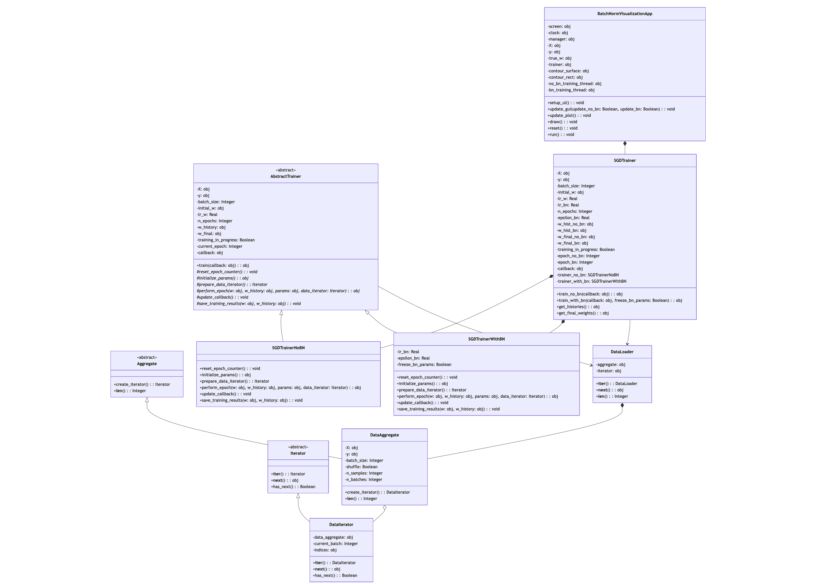

# Отчет

Данная работа демонстрирует применение паттерна проектирования "Шаблонный метод" (Template Method) в контексте работы с алгоритмами машинного обучения. Проект реализует визуализацию процесса обучения линейной регрессии с использованием стохастического градиентного спуска (SGD) как с применением Batch Normalization (BN), так и без него.

## Паттерн "Шаблонный метод" (Template Method)

Паттерн "Шаблонный метод" — это поведенческий паттерн проектирования, который определяет скелет алгоритма в базовом классе, позволяя подклассам переопределять отдельные шаги алгоритма без изменения его структуры. Он относится к категории поведенческих паттернов, так как определяет способ организации взаимодействия между классами и объектами.

### Основные компоненты паттерна "Шаблонный метод":

1. **Абстрактный класс** — определяет абстрактные примитивные операции, конкретные примитивные операции, а также шаблонный метод, который использует эти операции для реализации алгоритма.
2. **Конкретные классы** — реализуют примитивные абстрактные операции, переопределяя их для выполнения специфических шагов алгоритма.

### Зачем нужен паттерн "Шаблонный метод" в данном проекте?

В контексте машинного обучения часто имеются схожие алгоритмы, которые отличаются только в некоторых деталях реализации. Паттерн "Шаблонный метод" идеально подходит для этой задачи по ряду причин:

1. **Устранение дублирования кода** — общая логика обучения моделей вынесена в базовый класс, а специфические детали реализованы в подклассах.
2. **Разделение ответственности** — базовый класс определяет структуру алгоритма, а подклассы предоставляют конкретную реализацию отдельных шагов.
3. **Гибкость и расширяемость** — легко добавлять новые варианты алгоритмов, создавая новые подклассы без изменения существующего кода.
4. **Контроль над переопределением** — базовый класс может определять, какие шаги алгоритма могут быть переопределены, а какие должны остаться неизменными (с помощью final методов или hook-методов).
5. **Инверсия управления** — подклассы вызываются базовым классом, а не наоборот, что обеспечивает более стабильную архитектуру.

### Как паттерн "Шаблонный метод" реализован в проекте?

В проекте паттерн "Шаблонный метод" реализован в модуле trainer.py и состоит из следующих компонентов:

1. **Абстрактный базовый класс** (`BaseTrainer`) — определяет общую структуру алгоритма обучения:
   - `train()` — шаблонный метод, который определяет последовательность шагов обучения
   - `initialize_parameters()` — абстрактный метод для инициализации параметров модели
   - `process_batch()` — абстрактный метод для обработки одного батча данных
   - `update_model()` — абстрактный метод для обновления параметров модели
   - `calculate_metrics()` — конкретный метод для расчёта метрик производительности модели

2. **Конкретная реализация без BN** (`SGDTrainerNoBN`) — реализует алгоритм обучения без использования Batch Normalization:
   - Переопределяет `initialize_parameters()` — простая инициализация весов
   - Переопределяет `process_batch()` — прямой проход без нормализации
   - Переопределяет `update_model()` — обновление весов с помощью обычного градиентного спуска

3. **Конкретная реализация с BN** (`SGDTrainerWithBN`) — реализует алгоритм обучения с использованием Batch Normalization:
   - Переопределяет `initialize_parameters()` — инициализация весов и параметров BN
   - Переопределяет `process_batch()` — прямой проход с нормализацией батча
   - Переопределяет `update_model()` — обновление весов и параметров BN

На рисунке 1 изображена архитектура приложения с использованием паттерна "Шаблонный метод".



<center>рис.1 - архитектура приложения с использованием паттерна "Шаблонный метод" </center> 

## Как паттерн "Шаблонный метод" используется в проекте

Паттерн "Шаблонный метод" играет ключевую роль в организации процесса обучения:

1. **Единая структура алгоритма обучения**:
   ```python
   # В базовом классе BaseTrainer
   def train(self, data_loader, epochs):
       self.initialize_parameters()  # Вызов метода, который будет переопределен в подклассах
       
       for epoch in range(epochs):
           for X_batch, y_batch in data_loader:
               # Шаги алгоритма, определенные в базовом классе
               predictions = self.process_batch(X_batch)  # Переопределяется в подклассах
               self.update_model(X_batch, y_batch, predictions)  # Переопределяется в подклассах
           
           metrics = self.calculate_metrics()  # Общий метод для всех подклассов
           # Логирование результатов эпохи
   ```
   
   Базовый класс определяет общую структуру алгоритма обучения, а конкретные подклассы реализуют специфические шаги этого алгоритма.

2. **Разделение ответственности**:
   - Базовый класс `BaseTrainer` отвечает за общую логику процесса обучения
   - `SGDTrainerNoBN` отвечает за специфику обучения без Batch Normalization
   - `SGDTrainerWithBN` отвечает за специфику обучения с Batch Normalization
   
   Это обеспечивает хорошую модульность и облегчает поддержку и тестирование кода.

3. **Пример реализации метода в подклассе**:
   ```python
   # В классе SGDTrainerNoBN
   def process_batch(self, X_batch):
       # Простой прямой проход без нормализации
       return X_batch @ self.weights + self.bias
   
   # В классе SGDTrainerWithBN
   def process_batch(self, X_batch):
       # Прямой проход с нормализацией батча
       z = X_batch @ self.weights + self.bias
       # Применяем Batch Normalization
       mean = np.mean(z, axis=0)
       var = np.var(z, axis=0)
       z_norm = (z - mean) / np.sqrt(var + self.epsilon)
       return self.gamma * z_norm + self.beta
   ```
   
   Каждый подкласс реализует специфические детали своего алгоритма, но общая последовательность шагов определена в базовом классе.

4. **Hooks (крючки) для расширения функциональности**:
   ```python
   # В базовом классе BaseTrainer
   def after_epoch_hook(self, epoch, metrics):
       # По умолчанию ничего не делает, но подклассы могут переопределить
       pass
   
   # В классе SGDTrainerWithBN
   def after_epoch_hook(self, epoch, metrics):
       # Обновляем скользящие средние для параметров BN
       self.running_mean = 0.9 * self.running_mean + 0.1 * self.batch_mean
       self.running_var = 0.9 * self.running_var + 0.1 * self.batch_var
   ```
   
   Базовый класс предоставляет необязательные "крючки", которые подклассы могут переопределять для расширения функциональности.

## Заключение

Паттерн "Шаблонный метод" в данном проекте эффективно решает задачу структурирования различных алгоритмов обучения с сохранением их общей логики. Он обеспечивает чистое разделение ответственности между компонентами, позволяет избежать дублирования кода и предоставляет гибкую основу для добавления новых вариантов алгоритмов.

Проект демонстрирует, как можно применять классические паттерны проектирования в современных задачах машинного обучения, обеспечивая хорошую структуру кода и возможности для расширения. Благодаря использованию паттерна "Шаблонный метод", реализация различных вариантов алгоритма (с BN и без BN) стала более организованной и поддерживаемой.