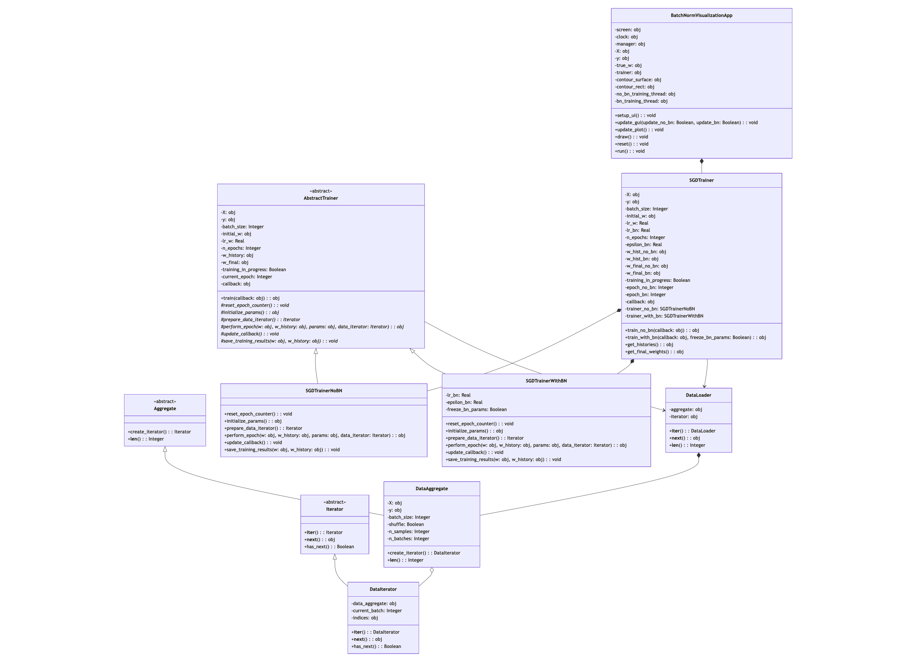

# Отчет

Данная работа демонстрирует применение паттерна проектирования "Итератор" (Iterator) в контексте работы с наборами данных для машинного обучения. Проект реализует визуализацию процесса обучения линейной регрессии с использованием стохастического градиентного спуска (SGD) как с применением Batch Normalization (BN), так и без него.

## Паттерн "Итератор" (Iterator)

Паттерн "Итератор" — это поведенческий паттерн проектирования, который предоставляет способ последовательного доступа к элементам коллекции без раскрытия её внутренней структуры. Он относится к категории поведенческих паттернов, так как определяет способ взаимодействия объектов.

### Основные компоненты паттерна "Итератор":

1. **Итератор (Iterator)** — интерфейс или абстрактный класс, определяющий операции для доступа и обхода элементов.
2. **Конкретный Итератор (Concrete Iterator)** — реализация интерфейса итератора.
3. **Агрегат (Aggregate)** — интерфейс или абстрактный класс, который определяет метод создания итератора.
4. **Конкретный Агрегат (Concrete Aggregate)** — реализация интерфейса агрегата, хранящая коллекцию и создающая итераторы для неё.

### Зачем нужен паттерн "Итератор" в данном проекте?

В контексте машинного обучения часто требуется последовательная обработка больших наборов данных порциями (батчами). Паттерн "Итератор" идеально подходит для этой задачи по ряду причин:

1. **Инкапсуляция деталей доступа к данным** — клиентский код (например, тренер модели) не должен знать, как именно организованы данные внутри.
2. **Разделение ответственности** — класс данных отвечает за хранение, а итератор — за обход и доступ к этим данным.
3. **Упрощение интерфейса доступа к данным** — единый интерфейс для доступа к разным структурам данных.
4. **Поддержка различных стратегий обхода** — например, перемешивание данных перед обучением (shuffle).
5. **Отсутствие необходимости загружать все данные в память** — можно итерироваться по частям больших наборов данных.

### Как паттерн "Итератор" реализован в проекте?

В проекте паттерн "Итератор" реализован в модуле data_loader.py и состоит из следующих компонентов:

1. **Интерфейс Итератора** (`Iterator`) — абстрактный класс с методами:
   - `__iter__()` — возвращает сам итератор
   - `__next__()` — возвращает следующий элемент коллекции
   - `has_next()` — проверяет, есть ли ещё элементы для обхода

2. **Интерфейс Агрегата** (`Aggregate`) — абстрактный класс с методами:
   - `create_iterator()` — создаёт объект итератора для данной коллекции
   - `__len__()` — возвращает размер коллекции (количество батчей)

3. **Конкретный Итератор** (`DataIterator`) — реализует обход по батчам данных:
   - Хранит ссылку на агрегат и текущую позицию 
   - Поддерживает перемешивание индексов для рандомизации выборки
   - Возвращает пары (X_batch, y_batch) при каждом вызове `__next__()`

4. **Конкретный Агрегат** (`DataAggregate`) — хранит данные и создаёт итераторы:
   - Хранит матрицу признаков X и вектор целевых значений y
   - Определяет размер батча и нужно ли перемешивать данные
   - Предоставляет метод для создания итератора

5. **Обёртка** (`DataLoader`) — для обратной совместимости с кодом, который может не использовать явно паттерн Итератор:
   - Делегирует все вызовы внутреннему агрегату и итератору
   - Реализует интерфейс итерации Python для прямой работы в циклах for

На рисунке 1 изображена архитектура приложения с использованием паттерна "Итератор".



<center>рис.1 - архитектура приложения с использованием паттерна "Итератор" </center> 

## Как паттерн "Итератор" используется в проекте

Паттерн "Итератор" играет ключевую роль в организации процесса обучения:

1. **Абстракция доступа к данным**:
   ```python
   # В классе SGDTrainer
   def train_no_bn(self, callback=None):
       # ...
       data_loader = DataLoader(self.X, self.y, self.batch_size, shuffle=True)
       
       for epoch in range(self.n_epochs):
           # ...
           for X_batch, y_batch in data_loader:
               # Здесь используем батчи данных без знания внутренней структуры
               # ...
   ```
   
   Обучающий алгоритм просто итерируется по батчам данных, не заботясь о том, как именно эти батчи формируются. Вся логика разбиения и перемешивания данных инкапсулирована в `DataLoader` и его компонентах.

2. **Разделение ответственности**:
   - `DataAggregate` отвечает за хранение и управление данными
   - `DataIterator` отвечает за стратегию доступа к данным
   - `SGDTrainer` отвечает только за алгоритм обучения
   
   Это обеспечивает хорошую модульность и облегчает тестирование компонентов по отдельности.

3. **Переиспользование и расширяемость**:
   - Легко добавить новые типы агрегатов (например, для чтения данных из файлов или баз данных)
   - Легко добавить новые типы итераторов (например, для стратификации данных)
   - Клиентский код не нужно менять при добавлении новых типов итераторов или агрегатов

4. **Поддержка стандартного протокола итерации Python**:
   ```python
   for X_batch, y_batch in data_loader:
       # Используем данные
   ```
   
   Благодаря реализации методов `__iter__` и `__next__`, итераторы можно использовать в стандартных циклах Python, что делает код более читаемым.

## Заключение

Паттерн "Итератор" в данном проекте эффективно решает задачу последовательного доступа к порциям данных при обучении модели машинного обучения. Он обеспечивает чистое разделение ответственности между компонентами, инкапсуляцию внутренних деталей и гибкость при добавлении новых способов обработки данных.

Проект демонстрирует, как можно применять классические паттерны проектирования в современных задачах машинного обучения, обеспечивая хорошую структуру кода и возможности для расширения.